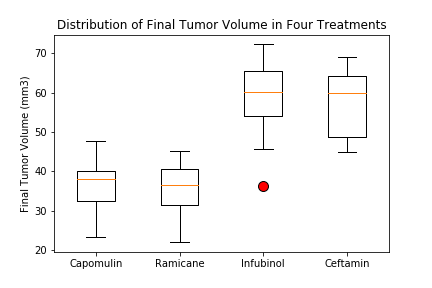
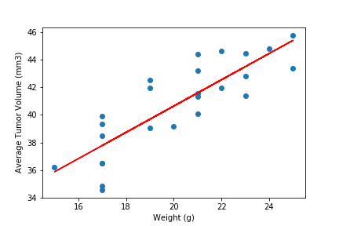
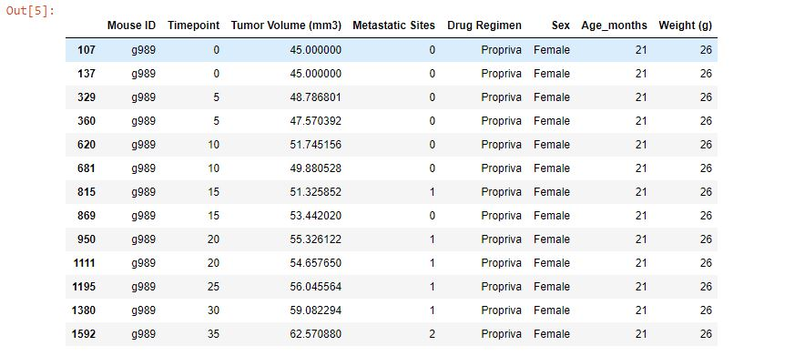

# SCC Tumor Study

1.) When taking a look at the four treatment drugs that were used for the experiment, Capomulin and Ramicane both exhibited a lower range of Final Tumor Volumes (mm3) than Infubinol (with the exception of the outlier) and Ceftamin (Distribution of Final Tumor Volume in Four Treatments). While this may be due to the sample sizes between these two sets of drugs (varying roughly by 50 units) (Trial per Drug), there is still on average about a 20 (mm3) difference in the sizes of the final tumor volume.

2.) When taking a look at the average tumor volume when compared to the varying mice weights, we see that there is a positive correlation between these two variables. As the tumor volume increases in size, the general trend is that the mice weights will increase as well. This is further supported by pearson r value of .84 (Mouse Weight versus Average Tumor Volume for Capomulin).

3.) The last thing to note is that there was a duplicated mouse data for unit g989, which tested under drug regimen Propriva. This mouse was removed from the data set altogether because it had the potential to skew the values for that given drug and generate results that may mislead the report.
